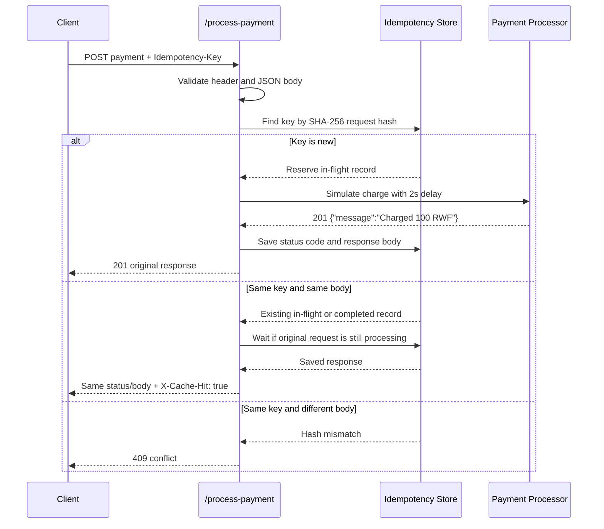

# Idempotency Gateway

IgirePay Technologies Ltd. needs a "pay once" gateway so payment retries do not double-charge customers. This project is a dependency-free Java REST API that processes a payment exactly once per `Idempotency-Key`, replays the original response for safe retries, and rejects key reuse with a different payload.

## Architecture Diagram



## Setup Instructions

Requirements:

- Java 17 or newer
- No database, Maven, Gradle, Redis, or external dependency is required
- Optional: Postman for manual API testing

Run on macOS/Linux:

```bash
sh ./run.sh
```

Run on Windows PowerShell:

```powershell
.\run.bat
```

Manual run:

```bash
javac -d out $(find src/main/java -name "*.java")
java -cp out com.igirepay.gateway.Application
```

The server starts on port `8080` by default. Override it with `PORT` or `-DPORT=8081`.

After the server is running, execute a smoke test:

```bash
sh ./scripts/smoke-test.sh
```

```powershell
.\scripts\smoke-test.bat
```

Run the full acceptance suite, including the in-flight race-condition test:

```bash
sh ./test.sh
```

```powershell
.\test.bat
```

Expected result:

```text
All acceptance tests passed.
```

## Postman Testing

You can test the API with Postman by importing:

```text
postman/Idempotency-Gateway.postman_collection.json
```

The collection uses `gatewayBaseUrl=http://localhost:8080`. If Postman shows a request going to port `5000`, you are using another environment variable named `baseUrl`; re-import this updated collection or set the URL manually to `http://localhost:8080`.

Run the requests in this order:

1. `Health Check`
2. `First Payment - Processes Once`
3. `Duplicate Payment - Cached Replay`
4. `Same Key Different Body - Conflict`
5. `Missing Idempotency Key - Bad Request`

The duplicate request should return the same `201` body as the first request and include `X-Cache-Hit: true`.

## API Documentation

### Health Check

```http
GET /health
```

Response:

```json
{"status":"ok"}
```

### Process Payment

```http
POST /process-payment
Idempotency-Key: order-123
Content-Type: application/json

{"amount": 100, "currency": "RWF"}
```

First successful response:

```http
HTTP/1.1 201 Created
Content-Type: application/json

{"message":"Charged 100 RWF"}
```

Duplicate response with the same key and same body:

```http
HTTP/1.1 201 Created
Content-Type: application/json
X-Cache-Hit: true

{"message":"Charged 100 RWF"}
```

Same key with a different request body:

```http
HTTP/1.1 409 Conflict
Content-Type: application/json

{"error":"Idempotency key already used for a different request body."}
```

Missing `Idempotency-Key`:

```http
HTTP/1.1 400 Bad Request
Content-Type: application/json

{"error":"Idempotency-Key header is required."}
```

Invalid body:

```http
HTTP/1.1 400 Bad Request
Content-Type: application/json

{"error":"Request body must include numeric amount and string currency."}
```

## Example Requests

First request takes about 2 seconds because it simulates a real charge:

```bash
curl -i -X POST http://localhost:8080/process-payment \
  -H "Content-Type: application/json" \
  -H "Idempotency-Key: demo-100" \
  -d '{"amount": 100, "currency": "RWF"}'
```

Retry with the same key and body returns immediately:

```bash
curl -i -X POST http://localhost:8080/process-payment \
  -H "Content-Type: application/json" \
  -H "Idempotency-Key: demo-100" \
  -d '{"amount": 100, "currency": "RWF"}'
```

Reuse the same key for a different payment and it is rejected:

```bash
curl -i -X POST http://localhost:8080/process-payment \
  -H "Content-Type: application/json" \
  -H "Idempotency-Key: demo-100" \
  -d '{"amount": 500, "currency": "RWF"}'
```

## Design Decisions

- The app uses Java's built-in `HttpServer` to keep setup small and review-friendly.
- Idempotency records are stored in a Java `ConcurrentHashMap`, which is allowed by the challenge brief. In production, this would usually be Redis or a durable database.
- Each record contains a SHA-256 hash of the normalized payment payload, the saved HTTP status, and the saved response body.
- `putIfAbsent` reserves a key atomically, which prevents two simultaneous requests from processing the same payment.
- A `CompletableFuture` represents the in-flight result. Duplicate requests with the same key and body block on that future, then replay the first response.
- Different request bodies with an existing key return `409 Conflict`.
- The first successful payment returns `201 Created`; duplicates return the same status and body plus `X-Cache-Hit: true`.
- Whitespace-only JSON differences are treated as the same payment because the fingerprint is based on parsed `amount` and `currency`.

## Developer's Choice: TTL Cleanup

Real fintech systems should not keep idempotency keys in memory forever. This implementation adds configurable time-to-live cleanup for completed idempotency records.

- Default retention: 24 hours
- Configure with: `IDEMPOTENCY_TTL_SECONDS`
- Expired completed records are removed by a background cleanup job
- In-flight records are never removed until they complete

This protects the service from unbounded memory growth while still preserving a retry window for clients.

## Project Structure

```text
src/main/java/com/igirepay/gateway/
  Application.java          # Server bootstrap and routes
  IdempotencyRecord.java    # Stored key metadata and in-flight future
  IdempotencyStore.java     # Atomic idempotency behavior
  PaymentHandler.java       # HTTP request handling
  PaymentRequest.java       # Minimal payment JSON parser
  ResponseSnapshot.java     # Saved response status/body
```
